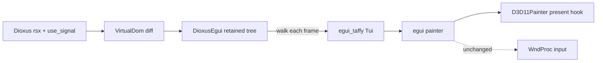

# Initiative: Dioxus UI Refactor

**Status**: In progress  
**Date**: 2026-06-18

---

## Goal

Replace Hachimi's imperative egui authoring layer with [Dioxus](https://github.com/dioxuslabs/dioxus) `rsx!` components rendered through the vendored [`dioxus-egui`](../../crates/dioxus-egui) bridge, keeping the existing DX11 Present/WndProc injection stack unchanged.

## Core insight

`dioxus-egui` is **not** a renderer replacement. It walks a Dioxus VDOM into [`egui_taffy`](https://github.com/dioxuslabs/taffy) → the same egui painter Hachimi already uses via `egui-directx11`.

Only the **authoring layer** changes: `ui.button(...)` → `rsx! { button { ... } }`.

## Decisions

| Decision | Choice |
|----------|--------|
| Crate location | Vendored in `crates/dioxus-egui` + `crates/honse-ui` |
| Plugin scope | Host + all in-repo plugins migrate to Dioxus |
| ABI wire format | Raw `egui::Ui` pointer unchanged; plugins embed their own `VirtualDom` |
| Paint backend | egui + DX11 (no Dioxus web/desktop/wgpu renderers) |

## Architecture

### Key modules (post-migration)

| Location | Role |
|----------|------|
| [`crates/dioxus-egui`](../../crates/dioxus-egui) | Dioxus → egui_taffy renderer; `render_in_ui` embed API |
| [`crates/honse-ui`](../../crates/honse-ui) | shadcn-style component kit |
| [`apps/hachimi/src/core/gui/dioxus/`](../../apps/hachimi/src/core/gui/dioxus/) | Host Control Center + tab Dioxus components |
| [`apps/hachimi/src/core/gui/dioxus_bridge.rs`](../../apps/hachimi/src/core/gui/dioxus_bridge.rs) | `DioxusMount` lifecycle helper |
| [`crates/hachimi-plugin-sdk/src/mount.rs`](../../crates/hachimi-plugin-sdk/src/mount.rs) | Plugin `mount(handle, app_fn)` |

### Unchanged

- [`apps/hachimi/src/windows/gui_impl/render_hook.rs`](../../apps/hachimi/src/windows/gui_impl/render_hook.rs) — Present hook
- [`apps/hachimi/src/windows/gui_impl/d3d11_painter.rs`](../../apps/hachimi/src/windows/gui_impl/d3d11_painter.rs) — DX11 painter
- [`apps/hachimi/src/windows/wnd_hook.rs`](../../apps/hachimi/src/windows/wnd_hook.rs) — WndProc input

## Phased roadmap

### Phase 0 — Foundation
- Vendor `dioxus-egui` + `honse-ui`; wire `dioxus 0.7` into workspace
- Feature-gate `eframe`/`run()` behind `standalone` so the injected DLL stays lean

### Phase 1 — Embed API
- `dioxus_egui::render_in_ui(ui, vdom, renderer)` with multi-pass settling (`max_passes = 3`)

### Phase 2 — Widget parity
- Grow renderer + honse-ui: combo/select, tabs, scroll, toggle, textarea, grid, images

### Phase 3 — Host vertical slice
- Control Center shell + General tab in Dioxus; `menu_preview` green

### Phase 4 — Remaining host UI
- All tabs, modal windows, transient overlays

### Phase 5 — Plugin SDK
- `mount()` with render-thread `VirtualDom`; ABI v15 + `DIOXUS_UI` capability

### Phase 6 — In-repo plugins
- training-tracker, race-hud, debug-viewer

### Phase 7 — Cleanup
- Remove imperative egui kit; update AGENTS.md + architecture docs

## Risks

| Risk | Mitigation |
|------|------------|
| Dioxus in injected DLL (size, thread-locals) | Validate in Phase 0 smoke build |
| Multi-pass settling with retained VDOM | Diff once, walk N times in `render_in_ui` |
| Per-frame VDOM walk cost | Acceptable for menu; profile overlay perf |
| egui type identity across DLLs | All plugins built from this repo only |

## What this initiative does NOT do

- Does not touch DX11/Present/WndProc hooks
- Does not change config/IL2CPP/hook APIs
- Does not adopt Dioxus web/desktop renderers
